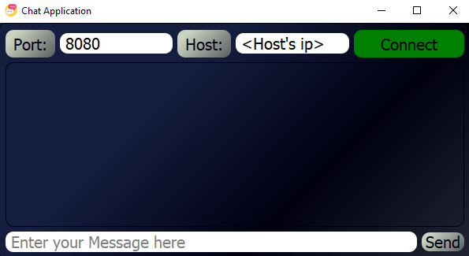
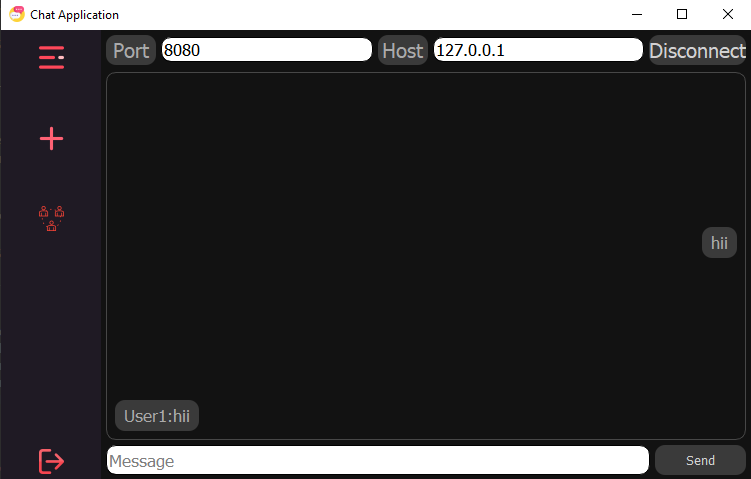
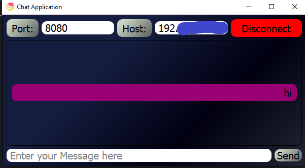

# 👋Introduction
We all humans are social beings and we all feel the need to interact with each other.Here is a small GUI chat application that helps you chat with your friend/family.

# 🏃‍♂️How to run the chat apllication
1. Clone the repository

``` bash
git clone https://github.com/sea-rod/GUI-Chat-Application.git
```
2. Change the working directory
```bash
cd GUI-Chat-Application
```
3. Install dependencies
```bash
pip install -r requirements.txt
```
or
```bash
python -m pip insatll -r requirements.txt 
```
4. Start server on the server computer
```bash
python ./server_socket/server.py
``` 
5. Enter the host as 0.0.0.0 and port number(A port number can range from  0 to 65536, but ports numbers 0 to 1024 are reserved for privileged services)
```
Enter the host name or ip address you to bind the server with:0.0.0.0
Enter the port:8080
```
6. Start run the `main.py` from the client computer
```bash
python main.py
```
7. Enter the port and the host's ip address and hit the `Connect` button


## To find the host ip

### If the server is hosted on a linux machine then open the terminal and enter the command:

```bash
ifconfig
```
### If the server is hosted on a windows machine then open the cmd and enter the command:

```bash
ipconfig
```

8. Enter your name and hit the `ok` button


9. Thats all your good to go. Enjoy the app 💖!!


# 🔨Built with
- [Pyside2](https://www.qt.io/): PySide2 is the official Python module from the Qt for Python project, which provides access to the complete Qt 5.12+ framework.

# License
This project is licensed under the MIT license - see [`License`](LICENSE.txt) file for details.