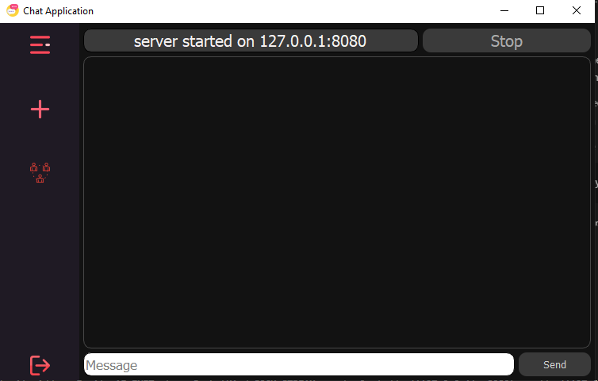

# 👋Introduction
We all humans are social beings and we all feel the need to interact with each other.Here is a small GUI chat application that helps you chat with your friend/family.

# 🏃‍♂️How to run the chat apllication
1. Clone the repository

``` bash
git clone https://github.com/sea-rod/GUI-Chat-Application.git
```
2. Change the working directory
```bash
cd GUI-Chat-Application
```
3. Install dependencies
```bash
pip install -r requirements.txt
```
or
```bash
python -m pip insatll -r requirements.txt 
```
4. Start run the `main.py` from the host computer
```bash
python main.py
```
5. The host needs to click the on create button on the side bar and then on the start button to start the server

6. The clients needs to run the same the host same as `step 4` 

7. The clients needs to click on the join button on the side bar then enter the ip adrress of the host   



>here the ip is 127.0.0.1


8. After enter the ip the clients needs to click on the connect button and then enter your name


9. Thats all your good to go. Enjoy the app 💖!!


# 🔨Built with
- [Pyside2](https://www.qt.io/): PySide2 is the official Python module from the Qt for Python project, which provides access to the complete Qt 5.12+ framework.
- [Flaticon](https://www.flaticon.com/): Icons used in this project are from flaticon 

# License
This project is licensed under the MIT license - see [`License`](LICENSE.txt) file for details.